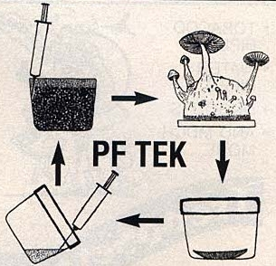
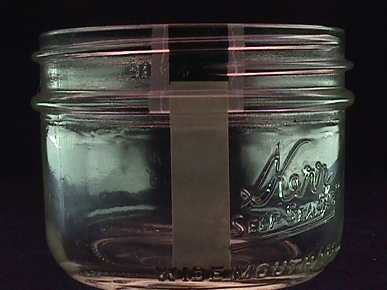
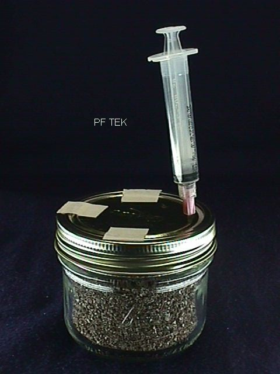
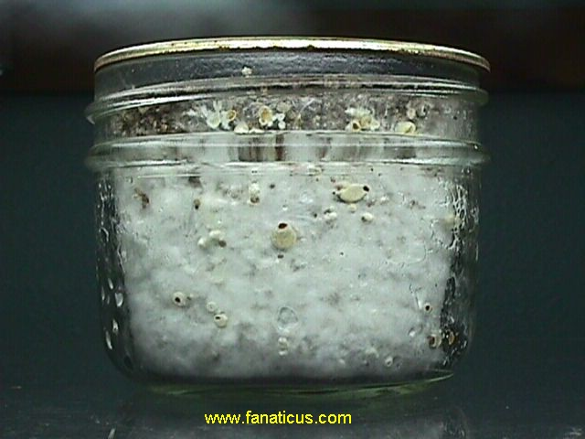
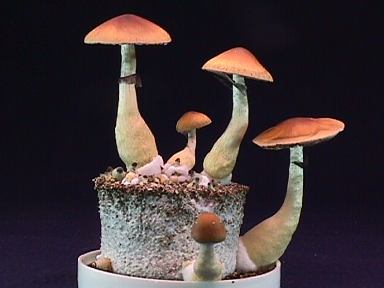
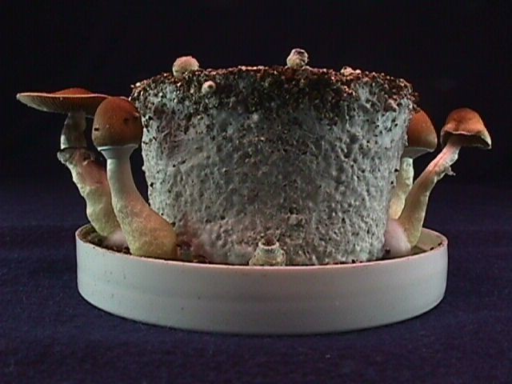
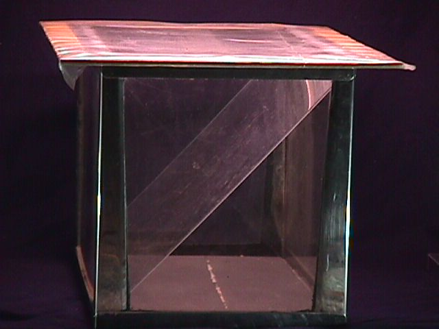
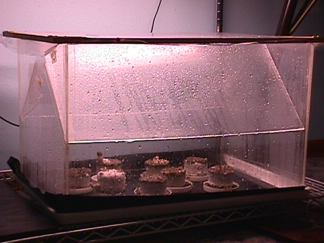
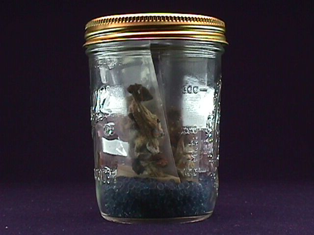
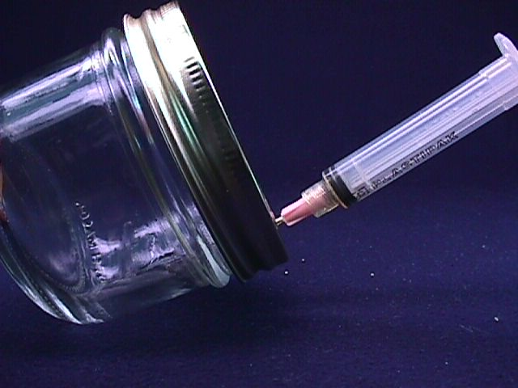

# The Original PF TEK

## 1. About PF TEK

This content is taken from the original **PF Tek**,  [http://www.fanaticus.com/](http://www.fanaticus.com/),  adopted to markdown language formatting. By capturing this in markdown I  hope to make the original PF Tek portable and accessible.  For instance, markdown can easily be converted to other formats, like PDF,  ePub or Wiki markups and in addition is very readable as-is. Probably of greater usefulness is when the markdown rendered back to HTML and displayed in a modern CMSs with well-designed presentations (themes). The PF Tek goes from being a really ugly HTML 1.0 site that is very hard to read on a mobile device, to one that reads just as well as any other page or post you would publish. We don't change any of the content, we just make it easier to read!

Snap shots of the origional site can also be found in the Internet Archives [Wayback Machine](https://web.archive.org/web/20190719194443/http://www.fanaticus.com/).

## 2. Introduction

by Robert McPherson (aka 'Psylocybe Fanaticus' or 'Professor Fanaticus')

These chapters are my famous PF TEK - the mushroom tek that has changed the world of magic mushroom cultivation. This is what the Feds didn't like and what the inquisition was all about. This is the essential version that is now world wide and practiced by thousands of mycofiles around the world.

The PF TEK is basically a brown rice method with an improved formula by using vermiculite as a base and adding pulverized brown rice. The secret is in the vermiculite. When mycelium is cultured in just grain, the mycelium turns into a mass with little air space. But when grown with vermiculite, the mycelial threads stretch across space. The important thing about the PF TEK, is that it copies nature. Instead of the usual cloning of mushroom tissue and growing mushrooms from that, a mass spore inoculation is employed directly to the fruiting substrate. That way, the genotype remains complete. Senescence (mutating and ceased fruiting) is no longer a problem. The spores insure a never ending succession of fungus, with all the power of the spores reproductive ability intact.

### Overview of Techniques

1. Brown rice powder, vermiculite and distilled water are mixed and loaded into a 1/2 pint jar, which is steam sterilized. The jar is then inoculated by the spore syringe.
2. After the substrate cake in the jar colonizes and begins to show signs of fruiting, the cake is released from the jar and placed into the dual chambered terrarium to fruit.
3. A mature mushroom is decapitated and spore printed in a jar.
4. Spore syringes are prepared with the spore print jar to begin another life cycle.

### Basic Materials List for Cultivation

#### PF Jar Preparation And Culturing (stage one)

1. Measuring cups and spoons
2. Large pot for steaming
3. Shoulder less half-pint jars with lids (Kerr or Ball)
4. Organic brown rice flour (organic food stores)
5. Horticultural vermiculite (medium or fine grade - not powdery)
6. Distilled or filtered drinking water
7. Heavy duty tin foil
8. Heavy duty (professional grade) masking tape
9. Ice pick (for punching needle holes in the culture jar lid)

#### Mushroom Growing (stage two)

1. 10 gallon aquarium
2. Cut piece of transparent plastic (Plexiglas) - (terrarium chamber partition)
3. Strips of wood with connectors and screws (terrarium lid)
4. Plastic film and thumb tacks (terrarium lid)
5. Small wall type thermometer
6. "All purpose" water spray bottle with an adjustable nozzle (hardware and grocery stores). Procure one that gives a good strong spray for instant humidification. Avoid recycled kitchen product sprayers. This is a critical piece of equipment. Only a good quality sprayer (a couple of dollars at a hardware store) can immediately supercharge the dual chambered terrarium with high humidity. Wire screen - plastic containers - plastic bags - (drying mushrooms)
7. DESICCANT (drying mushrooms) (scientific - chemical - lab supply)

#### Spore Printing And Spore Syringe Making (stage three)

1. Micro curved cuticle (finger nail) scissors (cosmetics - drug store)
2. Denatured alcohol (fuel - hardware stores)
3. Tequila shot glass and eye dropper (sterilizing and flaming)
4. Glass stirring rod (Scientific supply)
5. Plastic syringes (10cc or bigger) and 18 gauge 1 1/2 inch needles. Large sized syringes are good (20cc - 65cc) as well as extra long needles if available. (Retail medical - health supply - pharmacies - drug stores - scientific and lab supply)

## 3. PF Subtrate Formulation

Jars and glasses to be used with this technique are 1/2 pint capacity (8 ounces) - (250 milliliters). They must have tapered sides and no shoulders, otherwise the fungus cakes won't easily come out of the jars.

Appropriate jars; (source - super markets and hardware stores)

1. KERR wide mouth half pint canning jar - preferable
2. BALL wide mouth half pint (similar to the KERR wide mouth half pint) - preferable
3. BALL regular mouth half pint canning jar
4. BALL half pint jelly jar
5. 1/2 pint (250 ml) capacity drinking glasses (tapered sides)

!!! Note   
    Even though the regular mouth BALL half pint and the regular mouth KERR half pint look similar, the KERR is not tapered.

### Substrate Formula

#### By Cups or Milliliters

* 1/4 cup of brown rice powder (60ml)
* 1/2 cup of medium grade horticultural vermiculite (120ml)
* 1/4 cup of water (60ml)

#### Or by Volume

* one part brown rice
* one part water
* two parts vermiculite

The water amount is the crucial element that variates the results. The different brands of vermiculite varies in water holding capacity, creating differing moisture levels. So one can always vary the water amount (less or more than 1/4 cup), take notes and compare results. The highest water content can really make a great fruiting and give several flushes when the balance between the substrate elements is good.

Not all vermiculite is the same. The coarseness varies quite considerably among different brands. The coarser type will hold less water than the finer type which will alter the water holding capacity. If the formulation (water content) results in a really wet or sloppy substrate, use less water. Keep notes on formulas for replicating the substrate formula that fruits the best.

The above formula utilizes "HORTICULTURAL" vermiculite - a medium grade. To ascertain the size of the vermiculite particles, observe them under a photo magnifier next to a millimeter ruler. The finer type of vermiculite has particles averaging around 1 millimeter across (some larger and some smaller). The coarser type has particles averaging around 4 or 5 millimeters across and up to 8 millimeters. Stores usually carry one type, the "horticultural grade".

To make homemade brown rice powder, place some regular brown rice in a small canister type coffee bean grinder and grind it to fine powder. Freshly ground brown rice is recommended over prepackaged type. The freshness sometimes makes a big difference.

!!! Note   
    Water quality is indeed important. I have found out that "natural" water is the water to use. It makes for better cultivation of this mushroom on this simple substrate. Distilled water is good for making spore solutions and syringes and storing spore solution. But for growing, they seem to like the "natural" water such as: swamp, lake, stream, pond, river, ground or any water that is rich in organics. I have heard that "mineral" type drinking water is good and makes a difference. I suppose that water seeping from an organic compost pile would be about the best.

If the measuring cup specs aren't true, the formulas will be off, setting up certain failure or diminished growth. Check the cup measurers this way: 1 cup is 237 milliliters which is 1/2 pint or 8 liquid ounces (English measurement). There are 2 cups in a pint, 2 pints in a quart and 4 cups in a quart.

Prepare the canning lid by placing it with the rubber sealing edge upwards on a supporting surface and with a sharpened 3 penny nail (held with vise grip pliers) (or ice pick), punch 4 holes inside the periphery of the rubber sealing edge.

When using two piece canning jar lids, the inner lid (with the rubber edges up) rests on the top of the jar and when the lid band is screwed off, the lid remains resting on the jar top. To make the lid and band act as one lid, place pieces of masking tape on the lid attaching the band to the lid. Then, the lid can be adjusted for air ventilation and looseness like an ordinary one piece jar lid (after spore inoculation).

### PF Substrate Jar Preparation

Steam sterilizing PF substrate jars with regular cookware is possible because there is no grain to cook up and the substrate is airy. Other regular jars (other than canning type) or small drinking glasses (with tin foil covering) can be substituted for these canning jars. To insure similar results, make sure the jars or glasses are tapered sided with no shoulder of any kind, and that they have a 1/2 pint (8 ounce - 250 ml) capacity. It is important to note, that jars somewhat larger than 1/2 pint can be unreliable for the PF TEK and fail easily, unless the grower has experience with the PF TEK and compensates the formula. The low form KERR 1/2 pint canning jar is the most versatile (fits into tight spaces et).

A 3 piece vegetable steamer (pot, basket insert & lid) is used for the steam sterilizing stage. Also, the stainless steel vegetable steamers that fold out and stand on the bottom of the pot are good. Anything is good as long as it keeps the jar bottoms off the pot bottom where the high temperature will crack the glass.

**Step 1.** Place 1/4 cup of bron rice powder into a mixing bowl. Add the water directly onto the brown rice powder and mix it up and give it a few minutes to soak in. Add the vermiculite on top of the brown rice slurry. Thoroughly mix the ingredients. An electric mixer works great for this and makes it quick and easy. If there is no electric mixer, a couple of table knives does the trick also. The mixture should feel damp and cohesive (sticks together well). More water (or less) can be used if experimenting to improve the fruiting. Mix Each jars substrate individually for loading to insure accurate formula rendering and the best possible fruiting.

**Step 2.** Fill the jar very loosely. Leave a 1/2 to 3/4 inch space at the top. Level the substrate. With a tissue or a fingertip, wipe the insides of the jar clear of substrate residue down to the top of the substrate (very important - prevents contamination at the top). Fill the top of the jar with plain dry vermiculite and level it off at the top. This upper layer will protect the wet substrate from air borne contaminants. It acts as a contaminant barrier. This is a Psylocybe Fanaticus original discovery. What this dry vermiculite layer does is protect the wet substrate from airborne contaminants and also absorbs and regulates moisture transpiration and condensation.

In the photo, the black tape is the depth for the dry vermiculite. The masking tape shows where the pf substrate goes. The top layer of dry vermiculite must be between 1/2" to 2/3" deep to provide protection from contaminants entering from above.

### Tamping Down Tek

Getting the substrate level correct is very important. A slight tamping down is required. To get an accurate leveling of the substrate, loosely load the 1/2 pint jar and level the top of the mixture with the top of the jar. Screw a cap on the top to hold the mixture in. With one hand, hold the jar and lightly slam the bottom of the jar on the other palm a couple of times to lower the mixture level to around 1/2"-2/3" from the top rim. Further level and adjust the substrate with a fork down to the proper height. Clean the inside of the jar down to the substrate level with your finger tip or a paper towel and fill the jar back to the top with dry vermiculite.

**Step 3.** Place the lid on the jar with the rubberized edge up (jagged edges of the needle holes down). Screw the lid band on. Place pieces of "professional" grade masking tape (holds on during steaming) over the needle holes. This is to protect the needle holes from contaminant entry. When steaming or pressure canning is performed, the jars must be protected from water dripping down from the underside of the pot lid caused by heavy condensation and drip off during boiling. This water can get into the jars by entering under the jar lids that arenŐt tight and soaking the substrate - throwing off the formula and setting up failure. To prevent this, wrap some tin foil around the cap to ward off the water. The tin foil can be removed after steaming (with the tape guarding the needle holes - or the tin foil can be left on until it is inoculation time.)

**Step 4.** Heat the pot of water to a boil first then put the jars into the pot with the lid bands loose so that the steam can penetrate the jars quickly. The jars can sit in water but make sure boiling water can't slosh into the jars. Turn the heat down and GENTLY steam the jars at the lowest possible boil for an hour in a TIGHTLY covered pot (gas stoves are the easiest to control) (begin the timing when the water begins boiling again). A good tight fitting pot lid is essential for successful steaming.

Be careful to not overheat the jars, this dries the substrate. Drying is evidenced by o.k. spore germination and halted growth (the fungus will spread but stop at a certain point depending on how dry the substrate has become). Generally, any halted growth (with no contamination) is a sign of dried substrate. This is an important concept that will enable diagnosis and correction of problems experienced with drying. The remedy is to increase the water content of the substrate formula in use. After the jars have cooled, tighten the lids and store them in a cool draft free place until you are ready to inoculate them. As long as the lid is very tight, PF substrate jars can be kept for long periods before they are to be used. The only danger to this is water moisture loss.

### Pressure Canner Use

PF jars and water bottles can be quickly sterilized with a pressure canner. For proper and safe use of the pressure canner, always refer to the manual that comes with it. If the canner is used and has no manual , try to get one from the manufacturer before using it. Pressure canners can be dangerous if used incorrectly.

### Sterilization Times

1. 1/2 pint PF substrate jars - 12 p.s.i. for 30 minutes
2. Water bottles - 12 p.s.i. for one hour
3. Syringes and needles - 12 p.s.i. for 10 minutes

### Control Jar Technique

After the jars are steam sterilized, let them cool, tighten the lids and let them sit uninoculated for several days. Watch for any colored growths or changes in the appearance of the substrate. The tell tale rancid odor of bacteria can be easily detected by loosening the jar lid and checking for the odor. If there is contamination at this stage, the sterilization technique needs to be checked. Most likely it will be a to short sterilization time. If there is a problem at this stage, lengthen the sterilization time. If the jars remain clean and unchanged, they are ready for spore syringe inoculation. If contamination occurs after inoculation, the syringe was contaminated or the dry vermiculite layer was breached during inoculation.

## 4. Inoculation Of The PF Substrate Jars

Any jar to be inoculated must be cool to the touch before proceeding. Make sure the jar lid is tight. Shake the syringe well and remove the tape from the syringe needle guard. This shaking of the syringe is important as to redistribute the spores in the water. Take off the tape covering the needle holes. Remove the needle guard and insert the needle through the lid hole. Tilt the syringe body back towards the center of the lid with the needle tip touching the glass. This distributes the spore water down the side of the jar, giving a good inoculation down the side of the substrate cake. Inoculate a few drops down each needle hole. As the syringe plunger is pressed, observe the needle tip against the inside of the glass. As soon as water appears around the needle tip, release the syringe plunger pressure. In between each hole inoculation, shake the syringe a little to keep the spores distributed. Use 1 cc per jar. This will allow the syringe to inoculate 10 jars. More spore solution per jar can be used (speeds colonization - I use 3 cc per jar), but fewer jars can be inoculated. If the syringe needle plugs up as it is inserted into the substrate, draw the needle back a little and it will unplug.

In this photo, the needle tip can be seen resting against the inside surface of the jar. Then, when the solution is injected, it will run down the side of glass, giving an even inoculation. It is also important to add, that the vermiculite in this jar photo is very course. This makes the needle more visible for the demo. This type of vermiculite is best avoided.

### Alocohal Flamming Technique

If the syringe needle is touched, flame the needle to sterilize it. An alcohol flame is a clean flame whereas a butane cigarette lighter leaves behind an undesirable soot residue. To produce a short burning alcohol flame, place a tequila shot glass upside down. Using an eyedropper, put a few drops of denatured alcohol fuel (hardware store) on the hollow bottom of the glass and touch it with a match or lighter. The blue flame will cleanly and safely sterilize small stainless steel tools. Heat the needle in the flame for a few seconds to resterilize it. There might be a few "pops" of boiling water spurt out of the needle, but the spores within the syringe are safe. If there is some left over spore solution, replace the needle guard and store the syringe for later use. Resterilize the needle immediately before re-use. Store the syringe in a dark, cool place.

Also, just wiping the needle with rubbing alcohol soaked cotton will sterilize the needle. Let the needle dry for several seconds to evaporate the rubbing alcohol (alcohol kills spores), or pass the needle through the flame for a couple of seconds to complete the evaporation of the rubbing alcohol.

### Inoculation Of PF Jars Without The Lids

This technique can also be used if canning jars are not available (1/2 pint wide mouth canning jars are perfect and should be used at all cost). If regular drinking glasses are to be used - use regular tapered sided drinking glasses (8 ounce - 250ml)

Jars can be inoculated without using a lid with holes punched. Before trying this technique, inoculate with the punched lid first. That will show how it works without any problems (almost fail proof).

The only precaution to observe is to disturb the dry top vermiculite layer as little as possible, especially when removing the needle after the inoculation. The underlying substrate must not be exposed to the air. Carefully move any disturbed vermiculite back into place (with your finger tip). Replace the tin foil cover after inoculation.

### Icubation Of Inoculated Jars

After inoculation of the jars, tighten the lid bands and retape the needle holes. A tight lid preserves the water content of the substrate (very very important) and the growing and spreading mycelium will do fine with a tight lid all the way to the appearance of the primordia (using the air in the jar only). Place the jars in a safe place out of direct sunlight. Indirect light is all that is required. If the temperature is kept around 70 degrees, germination will begin within 3 to 5 days. Germinating spores appear as small white fuzzy spots, quickly growing and spreading with cottony white growth and strandy "rhizomorphs". Any room temperature is O.K. If it gets cold indoors, over head light shinning down on the tops of the jars is a perfect heating technique for this culturing stage. A clamping type light with a reflector works well for this. If this is done, keep the temperature around 70 degrees (don't overheat the jars - monitor the temperature with a thermometer). A warm overall house temperature is fine. But in the overall view, cool temperatures are never a problem. The rule is to not overheat.

### The Canning Jar Lid (loose or tight)

There are two choices with the lids during incubation - tight or loose. With a very high moisture content (good for fruiting), a tight lid can cause water to collect in the bottom of the jar. This is to be avoided. Water condensing in droplets on the inside of the jar during incubation is normal and is to be expected. If puddling on the bottom of the jar occurs, the lid should be kept on loose during incubation. Tape the canning jar lid to the band to make the lid act as a one piece lid for raising and lowering.

An excellent way of depuddling the jar is to use a long syringe needle and syringe. Without disturbing the top vermiculite layer, insert the long needle down to the bottom of the jar. Tilt the jar so that the water puddles down to the needle point and suction out the water. This works really great, but one needs an extra long needle to do it. Doing this can facilitate superb fruitings with the high water content without the puddling problems and possible deterioration of the substrate because of the water (drowning). With a high water content, there might be more than one depuddling procedure needed.

Also, there is another and even simpler way to depuddle the jar. One just simply inverts the jar and lets the water run down the side and is absorbed by the dry upper vermiculite layer. Most people do this and report excellent results.

If the substrate is on the dry side, a tight lid will preserve the moisture content. It is all a matter of the balance between the water needs of the mycelium, the size of the jar, the available air space in the jar and the type of vermiculite used. Only by simple experimenting and comparison can the right balance be found for a given set of conditions. Take notes and go with what fruits the best. But after many years of seeing all of this and all over the internet - web - the basic PF substrate formula as given rules.

After the substrate turns white with the mycelium (2 to 4 weeks after inoculation), the jars are left to sit in indirect light. The mycelium will continue to infiltrate the substrate until it gets enough food to trigger the fruiting cycle. In less than a week to a few weeks after surface colonization of the cake (cake appears all white), tiny white "pin" like structures begin to appear. This is called pinning. This is the beginning of the fruiting cycle. Soon after that, within the week, small round fungus growths appear that soon begin to turn yellow.

Lastly, "primordia" start to grow. These are tiny worm like structures with tiny reddish heads. These are the first mushrooms.

## 5. The Birthday Cake

This photo is of a 1/2 pint PF substrate jar about 23 days after inoculation (done with 3 cc of spore water and incubated at 70 degrees Fahrenheit). The primordia have appeared and it is now time to birth the cake. Wait until you see this, and the fruiting will be maximized. The fruiting is fairly relative to the primordia that appear.

The best time to remove the fungus cake from the jar is when the primordia (tiny worm like structures with reddish heads) appear on the cake while still in the jar. Be careful not to damage them in handling. The rule is to handle with care.

Remove the lid. With a clean fork, scrape away the majority of the dry top vermiculite layer. There will probably be seen some wispy mycelium here and there in the top layer. That is a good sign showing the healthy agressive nature of the mycelium. Place an old jar lid over the jar mouth and turn the jar upside down. Lightly slam the jar down on a table cushioned with a magazine. The fungus cake will slide out onto the old jar cap (BIRTHDAY). What I usually do is hold the jar without the lid on (top down) in my hand and carefully wack the bottom of the jar with a rubber mallet - the cake births nicely. When handling the fungus cake, be careful as not to squeeze and bruise it. Bruising results in a bluish mark. This fungus is resilient and can tolerate a certain amount of handling, but handle it as least as possible. The aroma is distinctly mushroomy, very pleasant.

As soon as the fungus cake comes out of the jar, place the cake with the vermiculite covered end down onto a preprepared soaked vermiculite (or perlite) filled saucer, old jar cap, petrie dish ect. It really makes no difference what end of the cake is down. Also, for some of the cakes, follow the PF casing technique (later in this chapter) as a way to make the fruiting max. Leave some cakes uncased for comparison. Daub the cake with a piece of loose tissue paper to soak up any water droplets that may have deposited on the cake as it comes out of the jar (actually, this doesn't have to be done, because the freed cake drinks it up within several hours). Immediately after the birthday, place the cakes into the dual chambered terrarium for the fruiting cycle.

This is the cake a few days after the birthday. This is a healthy fruiting start. Some of these primordia will abort, but most will go on to full development.

Some of the first mushrooms to form are "aborts" (convoluted caps, gnarly stems and stunted growth), and ironically they are primo in magic alkaloids. They are even more powerful in magic than the stately beauties that will soon dominate the cake. The tiny "baby mushroom" aborts are likewise good. After witnessing the growth of the fungus, recognition of these aborts is easy. As long as the aborts are healthy and pure, they are primo. Also, another form of mutants will manifest, blobs of fungus with little or no cap, also good for harvesting. And along with these mutants, appear the perfect specimens, the sporocarps.

It has been reported that Psilocybe Cubensis is a "weak" mushroom. PF and others have seen this to be not necessarily so. It all depends on how it is grown, on what medium and how it is harvested and preserved.

The secret to potent mushrooms is in their age when picked. It has been scientifically proven that the small immature specimens are significantly more potent than the larger mature specimens. Over half of the small primordia that first form will abort (cease growing, convolute and deform - depending on the strain). Pick these before their heads turn black. A pointed knife blade works well for removing these high potency primordia. These are among the most potent. The abortive mushrooms are also high potency. Harvest them when they are young and before their heads turn black. When the fruit bodies are normal, harvest them before the veil under the cap breaks. The mushrooms will be smaller and their heads will be roundish. It is important to note that the mushroom cakes pictured in this book are all mostly well matured. While these mature specimens are beautiful and perfect, they are not as potent as the diminutive specimens. The mature specimens are good for spore collecting and showcasing (photography) but are weak in psychedelic potency.

Grow them on brown rice, harvest them when they are young and cool dry them with desiccant. When this is done, they are an entheogen of the highest order.

### Time Scale Of The Mushrooms

1. Spore inoculation to spore germination - within a week, at 70 degrees Fahrenheit.
2. Spore germination to complete colonization of the cake - about 2 to 4 weeks or more.
3. Complete colonization to fruiting cycle start - within 2 weeks or more.
4. The fruiting cycle lasts about 2 weeks. After the initial flush, the mycelium cake begins to turn blue and no more mushrooms form. If the cake is thoroughly cleaned of aborts and stray fungus blobs after the initial fruiting and given the PF double ended cake casing tek, fruiting can be doubled or even tripled.

All in all, the process takes from 4 - 6 weeks from spore inoculation to fruiting.

### Contanminant Source Identification

Contaminant invaders appear in various colors from pastels to black. If they appear, the culture is doomed. Bacteria contamination is detectable through the top dry vermiculite layer as a sour foul odor within two days after inoculation (and no spore germination). If the jar is bacteria contaminated, be careful in cleaning it. Keep a safe distance from the contaminated substrate. Don't inhale the bacteria and wash your hands after touching it. Bacteria can be dangerous.

### Non-Germination Of Spores

1. The spore solution was not inoculated deep enough down into the jar. Instead of running down the side of the jar and inoculating the substrate cake, the solution was absorbed by the non-nutritive top vermiculite layer. To avoid this from happening, make sure that the spore solution flows down along the sides of the substrate cake by inserting the syringe needle so that the tip is below the non-nutritive upper vermiculite layer.

2. The substrate jars were not allowed to cool down after sterilization, killing the spores. Inoculate only when the jar feels cool to the touch.

3. There is evidence now that syringe boxes can be exposed to killing heat during transit (a very rare occurrence). The possibilities are such as over heated airplane cargo holds during intense heat waves or a superheated mail truck parked all day in the sun. Another possibility is that on arriving at the mail box, the syringe package was allowed to sit inside a broiling sun heated mail box, killing the spores.

4. Spore syringes can survive freezing, but extreme low temperatures are probably destructive to the spores.

## 6. Double Ended Cake Casing

The photo on the top is a second flush off of a PF spore race cake. The cake under the first photo is a third flush.

### First: In Vitro Primordiation

There are many ways to extend the life of a cake and get more shrooms. The essential pf tek is to always allow primordia to appear on the cake in vitro. But not only that, wait for more. So when you spot the first primordia, wait around 3 to 4 more days before birthing. This stimulates more of them, and then your first flush will be fat. This invitro primordiation works well with most all of the spore races (strains) available. A few of the strains don't primordiate well invitro so they need to be birthed after about a month invitro, and then given the casing treatment.

### Second: The Casing Tek

Another really good way to max fruitings, it to not wait for the invitro primordiation. As soon as the cake turns completely white, it can be birthed and then cased. Immediately after the cake is first birthed is the time for a casing. fill a jar cap with vermiculite, soak it and drain it. Place the cake on top of the wet vermiculite.

Next, pour dry vermiculite onto the top of the cake until it starts to spill off. Flaten the top of the vermiculite with your finger to about 1/8 to 1/4 nch depth. With an eye dropper or old syringe, slowly drip water onto the top dry vermiculite layer until it is soaked completley.

Spraying and maintenance

Once the top layer is totally soaked, place the cake into the terrarium and leave it alone. Follow the Terrarium tek.

### Casing And Recasing

The cake whitening phenomenon

One of the most interesting effects of this tek, is the revitalization of the cake. After the initial fruiting, if it is really fat, the cake will be a bit blued. One of the signs of old age in PF cakes is the bluing that will occur. Most likely, the cause of this overall bluing of the cake is moisture loss and thirst of the cake. When the PF double ended cake casing tek is employed, the cake will gradually turn white again. After about a week under the casing tek, the cake will be completely white again and on its way to a good second flush.

This casing tek seems to work better if you completely clean the cake after the first casing flush and recase with fresh vermiculite. After the flush occurs, the top and bottom vermiculite layers should be scraped off and replaced. A good way to do it is like peeling an apple. Hold the cake in your hand without squeezing, and with a knife, scrap the old vermiculite off the cake. Try to clean down to the surface of the cake. The scraping doesn't hurt the cake at all because these older cakes become "tougher". The mycelium tends to be "tighter" and less fluffy and the cake becomes contamination resistant. This "toughening up" and recasing of the mycelial cake is also reported in the old OSS and OERIC (McKenna brothers) mushroom cultivation book published in 1976.

After the cake is carefully cleaned (rather a painstaking procedure but not difficult), the cake is placed on a freshly soaked and drained bottom layer of vermiculite (on a plate or in a jar cap). Then, fresh dry vermiculite is poured over the top of the cake and smoothed down to a layer of 1/8 to 1/4 of an inch and the basic casing wetting procedure is employed. The spray bottle offers a good way to drip water onto the casing. By slowly squeezing the spray lever, the water will drip out in single drops. You can also use an eye dropper. Slowly wet the top layer. If you apply to much water and it over soaks the vermiculite, the cake can be tilted and excess water drained from the top vermiculite layer.

After every flush - reclean the cake and apply fresh vermiculite. What this does is prevent contaminants from building up. The cakes stay uncontaminated and fruitable for a good two to three months. You can get several flushes out of a properly cared for cake. This casing tek keeps the cake white and uncontaminated for its life duration.

## 7. Dual Chambered Terrarium

Standard 10 Gallon Aquarium

The Airtight Aquarium Lid (Top)

24" X 14 1/2" outside dimensions
21 1/4" x 12" inside dimensions (dimensions variable).
The frame can be made of flat (unwarped) 1/4" thick board or 4 wood strips connected by screws.

The wooden lid frames' inner rectangular cutout must be LARGER than the top of the aquarium. Clear polyethylene plastic film is tacked to the underside (or upper side) of the frame so that the frame holds it tightly onto the aquarium top. The frame essentially hangs by the plastic film. A simpler alternative is to cover the aquarium top with saran wrap or something similar. The most important point to be stressed is that the aquarium must be sealable with no air leaks, for humidity retention.

### The Spray Shield/Chamber Partition
(for a standard 10 gallon aquarium)

Use 1/8" thick clear acrylic (Plexiglas) window insulation available at most hardware stores. Have it cut around 15" x 18" (dimensions may vary - check the aquarium first). A loose fit is good as long as the cakes are protected from the direct spray.

### Dual Chambered Terrarium Techniques

The mushrooms get water from 2 sources; the substrate they grow on and the air that surrounds them. The surrounding air must be highly humidified. The fungus needs to bathe in a shroud of floating water molecules. 100% humidity is where there is the maximum number of water molecules floating amongst the air atoms. The dual chambered terrarium easily achieves these conditions.

It all starts with the spray from the hand sprayer. The first rule is to never directly spray the fungus. This initial spray is comprised of water droplets that are giant ponds of water in relation to the fine mycelial networks of the fungal threads. In culture, the droplet of water will drown the micro world of the fungal structures and thereby inhibit or contaminate growth. But the airborne molecularized water floats into the fine structures and gives the fungus humidity as needed. Molecularized water is another way of describing water that has evaporated into the air.

The spray that comes out of the spray bottle must be molecularized for the fungus. The spray shield and the primary chamber accomplish this. The primary chamber receives the initial spraying where as the shroom cakes are behind it. As the spray strikes the shield, it is broken down into a finer mist which flows around the sides of the spray shield into the secondary chamber where the fungus is bathed in the fine humidity safely away from water droplets. In a matter of time, this humidity will condense out onto surfaces inside the terrarium and drip down. The spray shield is slanted and therefore acts as a drip shield and roof, so the more condensation the better. Also, the spray shield adds more surfaces to the insides of the terrarium which increases the amount of moisture that can evaporate.

### Spraying Procedure

First, before placing the cakes into the terrarium, spray all the inside surfaces of the terrarium, including the spray shield and lid. Insert the fungus cakes and put the spray shield and lid in place. Then, slightly lift up the lid and insert the nozzle of the water spray bottle in between the lid and the top of the aquarium and vigorously spray downwards into the middle of the shield. After about 5 seconds of spraying, immediately withdraw the sprayer nozzle and let down the lid to seal the swirling mist inside the terrarium. Make sure that all the inside surfaces of the terrarium are foggy or dripping with water. This in itself helps generate humidity.

It has been seen that mushrooms will grow very well in a properly set up dual chambered terrarium, with only one good spraying a day - and even less than that. This is one of the amazing features of the PF TEK. With the cake cased, I have seen great shrooms grown like this with little attention given to the terrarium. PF style cakes actually seem to need less humidity than any other way of growing shrooms as long as the double ended cake casing technique is employed. PF cakes, when birthed, don't need 100% humidity to fruit well. It is very true, that cased grain and such need the very high humidity, but PF cakes don't. And that is because the cakes themselves humidify the space around them because of the vermiculite content. Vermiculite holds a lot of water and will both absorb and release moisture.

Each time the terrarium is sprayed, the fungus should be ventilated. To ventilate, take off the lid, and while holding the spray shield vertically, fan the chamber with a piece of cardboard, and then spray as above. Also, the water that collects in the bottom of the terrarium must be siphoned out (prevents bacteria buildup). This can be easily done using a rubber bulb battery filler (auto parts store) or a rubber bulb type enema bottle.

Expose the terrarium to normal room light (indirect sunlight). A small low wattage fluorescent plant light positioned above the terrarium will make the phototropic mushrooms grow upwards. Leave it on all the time if desired.

### Heating

The main rule is to not heat the dual chambered terrarium. Any direct heating works against the humidification andadds a drying influence. Do not use heating cables, heat pads or blankets. Don't shine light directly down into the terrarium. Keep any plant grow light (low wattage only) a safe distance from the terrarium. These fungi grow well at 60 degrees Fahrenheit. PF has even seen them growing perfectly at temperatures cooler than 60 degrees. They grow slowly when they are cool. When warm or at heated room temperature, they grow very fast. Strive for a growing temperature between 65 and the upper 80's. A too hot terrarium will result in lots of spreading mycelium, but no fruiting. It has been reported by other authors, that these cubensis mushrooms will have a higher potency when grown at cool temperatures. They grow much slower, but they seem to be denser in their flesh then when grown warm.

### Symptoms of low Humidity

When the humidity is a bit low, but not low enough to stop fruiting, the mushrooms can have fuzzy white mycelium growing on the tops of the caps. When this occurs, the cap looks like it has a crown of white hair. This is not contamination. This white fuzzy mycelium is perfectly good and does not detract from the mushrooms quality.

Deformed, convoluted, and withering mushrooms and primordia are signs of low humidity. For the best growth, the humidity has to be high.

## 8. Rich Mans Terrarium

This is the terrarium that was used in the perlite and terrarium tests. I found it at a new and used resteraunt supply store in Seattle for $25. This is a covered food display tray.

It works great with perlite (and without) and holds 9 half pint cakes. The one above has 7 cakes. The cakes are post initial flush and the fruitings are secondary fruitings. The fruitbodies that appear late are always superb in form.

If you can't find one of these in your local town, you can order one for around $75 (hence - the "richmans'"). Call the manufacturer (Cal-Mil) in California at 1 800 321 9069. They will tell you where you can order it (from one of their distributers near your town).

Unfortunately, sometimes a distributer will require a minimum of an order for two. But fortunately, the terrarium they will send you for the above price is bigger than the one pictured. It has room for several more cakes, making for a goodly capacity. All the shrooms pictured at this site were grown in one of these.

The catalog numbers are:
314-15 -- the "connoisseur cover"
316-15 -- "Deep Tray" bottom half
The unit is 15 inches in diameter and about that tall.

To use this terrarium, first spray the insides. Place the cakes in. Hold the cover above the tray and spray a fine mist into the air about 2 feet above the cakes in the tray and immediately lower the cover down onto the tray - trapping mist. Air and mist once a day. But what is so cool about this, is that neglect goes a long way! (set it up and leave it).

It costs, but it works so nicely, and it makes a nice coffee table display. If your landlord comes by to inspect, he will see it, look down and say, "hey, nice shrooms, what kind are they"? Then you say, "I got it from a science catalog company and it is a new miniature fungi growing kit and the shrooms are not edible - just wild". (or something absurd like that). Then your landlord will look approvingly around, notice the neatness and tiddyness of your domecile, and leave, little knowing that he just observed the food of the gods.

### The Ultra Richmans Terrarium

This terrarium was made by a plastics fabrication expert. It isn't cheap (like a poor mans Whalmart plastic storage box) but if you can find the right person - the cost is a bit more than the richmans dome above. It is made out of acrylic clear plastic. It is one piece, with a removable spray shield. At the top, is a spray hole with a rubber stopper. It is designed to hold one fruiting cake to maturity, but it can hold 4 cakes tightly. The cake inside is a first flush PF spore race cake - typical of a first flush obtained with the pf tek.

The terrarium is open bottomed so it fits over the cakes that sit on a tray. This is the most fool proof terrarium one can have. And it can be made bigger - as big as a ten gallon aquarium or larger. The plastics expert can make one just by looking at the photo and you giving him the dimensions that you want or by giving him the tray that you have to fit the terrarium to it. Very tricky - but it isn't hard to find someone (a professional) who can do it if you live in any kind of large town.

This terrarium was built by myself out of plexiglas. It employs the Dual Chambered Terrarium techniques previously discussed in the PF TEK. This terrarium has been hooked up with humidifiers for automatic 100% humidification. It also works great with just a sprayer. The inner "roofs" make this type of terrarium as fool proof as they can get - in other words, they can't be beat for shroom growing.

## 9. Cool Temperature Drying (desiccation) of Mushrooms

The immature specimens are the best in quality, digestibility and potency. They are characterized as being very light in color with white stems and light colored caps. The cap will spread out after the veil breaks. Just before or right after the veil breaks is a good time to harvest. The gills on the underside of the cap will be light in color. The mushrooms will be conical shaped and sporulation hasn't really begun yet. These are the mushrooms that are the best for harvesting.

1. The easiest way to dry the fungi is to place them on a wire screen with air available to all sides. Never dry them in an oven or use hot air dryers. The heat leaches the chemical constituents and reduces their quality.

2. Using a frost free (dehumidifying) refrigerator works but it is time consuming and then everyone doesn't have a frost free fridge.

3. Using desiccant to cool dry mushrooms is overall, the best drying technique.

### Materials Needed

* Desiccant
* Wire screen
* Plastic tub or container
* Plastic bag with tie off.

### Desiccant Sources

1. "DRIERITE" desiccant. (chemical and science supply retailers). It is the universal lab desiccant.
2. Silica Gel granules - desiccant. (Chemical and science supply) .

! Warning: These products might have toxicity warnings - (don't breathe the dust and try not to touch it directly - it dries skin.). Follow those rules, but know that desiccant in an airtight box and under a screen will do nothing to the fungi except dry them. It is completely safe for this use.

What desiccant does, is absorb moisture out of the air. As the fungus transpires moisture, the moisture is immediately absorbed back into the desiccant, drying the fungi. Desiccant can be reused and lasts indefinitely. After use, the desiccant is heated, dried and stored for future use. To be sure the desiccant is dry and ready to work, heat the desiccant in an oven as instructed by the manufacturer before its' first use. This preheating should be done before the desiccant is used because when it is purchased - it is usually somewhat damp which will thwart its function for drying air. Store it in an air tight container so that it stays dry and ready for use.

In drying a medium sized mushroom such as Psilocybe Cubensis, use a 2 inch layer of desiccant on the bottom of the container, under the mushrooms. Place the mushrooms on a wire screen and lay them on the desiccant that is in the container. Put the container with the shrooms and desiccant into a plastic bag. A garbage bag type wire tie is sufficient to close the bag. If a clear plastic bag can be found, use that to observe the drying process. After 24 hours, a little shriveling of the shrooms can be seen. About 4 or 5 days later, the shrooms will be dried rock hard. To check the drying - the stem should snap cleanly when bent.

!!! Tip   
    For the best alkaloid preservation technique, the desiccant box can be put into the refrigerator and the mushrooms dried at near freezing temperatures.

Actually, about the easiest and most effective way to dry the mushrooms is to pre dry the mushrooms in the air on a wire screen. This works very well if the the room humidity is not high. After a couple of days, the shriveling fungus can be quickly and completely dried in the desiccant box. So a combination of air drying and then desiccant drying is one of the best ways there is to dry the mushrooms.

Mushrooms dried in this way lose hardly any chemical constituents and their truly desiccated state preserves them in their prime for months.

Store them by sealing them in plastic bags or keep them in canning jars with the rubber edged canning lid on tight (as in the photo - dried shrooms in little bags stored on top of desiccant). The freezer is a good place for preservation, but make sure the fungi are tightly sealed in their containers to protect them against the moisture in the freezer.

## 10. Spore Printing and Spore Syringe Preparation

Shroom caps (PS. SEMILANCEATA) printing while sitting on a wire holder

The mature specimens are good for spore production, but are not as good for consumption (weaker potency). They are characterized as becoming darker, with dark bluish colors appearing on the caps and stems. The cap upturns and reveals gills darkening a deep brown color. The mushroom will look like an umbrella that has turned up edges. On the stem can be seen the purple deposits of the dropping spores. Mature adult mushrooms release spores by the millions. In the area around the mushrooms can be seen a deepening color of purple. As the spores fall and collect they will color deep purple. This is the signal that the mushroom has matured and is now in its sporulation cycle. This is the time to take their spores.

### Spore Printing Equipment

* KERR 1/2 PINT WIDE MOUTH (LOW FORM) CANNING JAR. (ANY SUITABLE JAR IS OK)
* FINGER NAIL CUTICLE SCISSORS - (cosmetics - drug stores)
* ALCOHOL, TEQUILA SHOT GLASS AND EYE DROPPER.

1. Pre sterilize the jar and regular metal lid (rubber edge up) in a small toaster oven at around 300 degrees Fahrenheit for around a half hour. Keep the lid loose during the sterilization cycle. When the jar has cooled down, tighten the lid until it is time to use the jar for a spore print. The rubberized edge will be a bit melted, but that won't be any problem in this technique.

!!! Warning  
    What follows is a sterile technique. The first rule that must be always followed is to wash hands prior to sterile work. Hands are a prime source for bacteria and micro spore contaminants. Sterilize all the work surfaces with rubbing alcohol. Minimize drafts. Try for a still air environment. Don't breathe on the work. Run a small home appliance style HEPA air cleaner (99.97% rated efficiency - available at drug and department stores) for a few hours in a closed room to clean the air before doing sterile work.

2. Flame sterilize the scissors with an alcohol flame and snip off the mushroom cap. Cut the top of the stem as far up into the cap as possible so that the gills of the mushroom will sit flat on the surface of the jar bottom. With quick and sure movements, place the cap into the jar and place the lid on loosely. Pierce the top of the cap with a straight pin to pick it up and handle it.

3. Leave the jar with a loose cap for a couple of days in a draft free area away from direct sunlight. After the print is taken, quickly and with as little air disturbance as possible, remove the jar cap and extract the mushroom cap from the jar. With a loose jar cap, let the jar sit in a draft free place to dehumidify for a few days before sealing it up (with tape) because there will be some residual moisture left behind on the spores and glass. Store the spore print jar at room temperatures in a dark place away from sunlight. Don't store it in a refrigerator.

Psilocybe Cubensis spores begin to degrade a few months after they are taken. After approximately 1 1/2 years, spore germination will be greatly reduced or won't occur at all. Germination is massive and quick when the spores are fresh.

### Making a Spore Syringe

Materials list:

1. Spore print in jar.
2. Sterile syringe with water for injecting water into the spore print jar.
3. Empty sterile syringe for loading spore solution out of the jar.
4. A small Pyrex glass stirring rod (science - lab supply).
5. Alcohol, tequila shot glass and eye dropper.
6. Lid with two holes. Prepare this lid by drilling a hole in the center of the lid to fit the Pyrex glass stirring rod. Punch the second hole near the edge of the lid (rubberized edge up) to fit a syringe needle.

### Syringe Preparation

Boil a pot of water. Draw boiling water into a syringe and squirt it out several times. Refill the syringe with boiling water, replace the needle quard and wrap the syringe in tin foil. Prepare several syringes like this. Drop the syringes into the boiling water and boil them for one hour. Let them cool before using. Sterilze empty syringes also.

The main point of this technique would be to expose the interior of the jar to as little room air as possible. Always protect the holes in the lid by placing tin foil or sterile surgical tape over the holes before and after this procedure.

A GLASS LAB STIRRING ROD IS USED TO SCRAPE SPORES OFF THE BOTTOM OF THE JAR AND INTO THE WATER (they stick to the bottom when printed)

THE SYRINGE IS INSERTED THROUGH THE NEEDLE HOLE AND SUCTIONS OUT SPORE SOLUTION

1. Inject sterile water into the spore print jar through the needle hole.
2. Flame sterilize the glass stirring rod and let it cool a minute. Insert it through the center lid hole and with the rod end, scrape spores into the water.
3. Insert the sterile syringe needle through the small hole at the edge of the lid. Tilt the jar until the water comes up to the needle tip and draw the spore water into the sterile syringe.

Store the syringe at cool temperatures in the dark. A properly prepared spore syringe will be good for several months and even up to a year or more.
